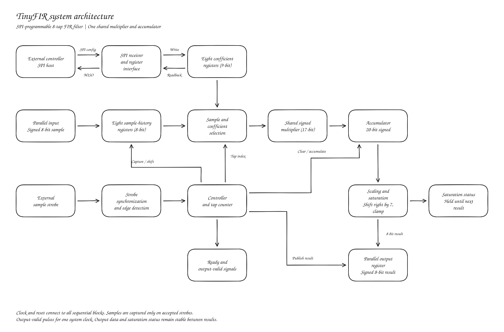

# TinyFIR: SPI-Programmable 8-Tap FIR Filter

**Platform:** Tiny Tapeout, GF180 nm, combined 1x2 tile allocation  
**Team:** Hamza Soofi, Gurpal Johal, Mohil Kadakia, and Ayaan Tunio  
**Status:** Proposed design performance and area targets require implementation verification

## 1. Statement of purpose

This project will design and implement a programmable eight-tap finite impulse response (FIR) filter. The circuit will use a 1x2 Tiny Tapeout tile on the GF180 nm process.

The filter will calculate a weighted sum of the current digital input sample and seven previous samples:

$$
y[n]=\sum_{k=0}^{7}h[k]x[n-k]
$$

The coefficients will be programmable through SPI and restricted to a range between -1 to +1. Samples will enter through the eight parallel input pins, and filtered results will appear on the eight parallel output pins. An external sample ready input will determine when each sample is captured, allowing the sampling rate to vary independently of the faster system clock.

One shared multiplier and accumulator will process the eight taps sequentially to reduce area. Sample history and coefficients will be held in registers. The circuit will also contain an SPI interface, controller, scaling and saturation logic, and status outputs.

The project will demonstrate low-pass, high-pass, and band-pass filtering by loading different coefficient sets into the same hardware. It will develop experience with fixed-point DSP, register-transfer-level design, verification, and ASIC implementation. The scope is entirely digital: any ADC, DAC, or analog signal conditioning is external to the chip.

## 2. System diagram

Clock and reset connect to the sequential blocks. Saturation logic also drives the saturation-status pin.

|Block|Function|
|-|-|
|SPI interface|Receive coefficient writes, decode register addresses, and return coefficient/status readback|
|Coefficient registers|Store eight signed 9-bit coefficient integers|
|Sample-history registers|Store the current sample and seven previous samples and shift only on an accepted sample|
|Strobe synchronization|Transfer an external sample request safely into the system-clock domain|
|Controller and tap counter|Sequence capture, the eight tap calculations, and result publication|
|Selection logic|Select the sample and coefficient for the current tap|
|Shared multiplier and accumulator|Calculate and sum the eight products|
|Scaling and saturation|Convert the accumulated result to an 8-bit value without wraparound|
|Output register|Hold the latest result until the next result is produced|

For each accepted strobe, the circuit captures the sample, updates the history, clears the accumulator, processes all eight taps, and publishes the result with an output-valid pulse. The sample strobe is a request signal, not a second clock driving the FIR datapath.

## 3. I/O pin assignment table (Tiny Tapeout pins)

Directions are relative to the FIR circuit. The uio labels identify physical bidirectional channels. Their input and output paths are accessed through the corresponding `uio_in` and `uio_out` signals in Verilog.

|Tiny Tapeout signal|Direction|Assigned name|Function|
|-|-|-|-|
|`clk`|Input|`clk`|Faster system clock for processing and interface logic|
|`rst_n`|Input|`reset_n`|Active-low reset|
|`ui_in[7:0]`|Input|`sample_in[7:0]`|Signed 8-bit parallel input sample|
|`uo_out[7:0]`|Output|`sample_out[7:0]`|Signed 8-bit filtered result|
|`uio[0]`|Input|`spi_sclk`|SPI clock|
|`uio[1]`|Input|`spi_mosi`|SPI data from the host|
|`uio[2]`|Output|`spi_miso`|SPI data returned to the host|
|`uio[3]`|Input|`spi_cs_n`|Active-low SPI chip select|
|`uio[4]`|Input|`sample_strobe`|Requests capture of the sample input bus|
|`uio[5]`|Output|`ready`|High when the circuit can accept a sample request|
|`uio[6]`|Output|`output_valid`|One-system-clock pulse announcing a new result|
|`uio[7]`|Output|`saturated`|Indicates whether the latest result was clamped|

The wrapper also has the Tiny Tapeout framework signal `ena`. It is not an additional freely assignable external pin. Pins 5-7 are outputs and pins 0, 1, 3, and 4 are inputs. Pin 2 drives MISO only while SPI is selected and is otherwise high-impedance. Unused output paths are tied to defined values.

### Sample-transfer contract

* The host presents a stable sample and raises `sample_strobe` only while `ready` is high.
* A synchronized rising edge causes one sample acceptance. Holding the strobe high does not repeatedly capture samples.
* The proposed asynchronous-host timing rule is to establish the data at least one system-clock period before raising the strobe, hold the strobe high for at least three periods, and hold the data until `ready` falls to acknowledge capture. Keep the strobe low for at least three periods before another request. These margins will be checked against the final synchronizer implementation.
* The full data bus must remain stable during capture. Independently synchronizing its eight bits is not a substitute for this contract.
* Requests detected while busy are not queued. The host must obey `ready`.
* The output remains stable between results. `output_valid` lasts one system-clock period. A receiving device must be able to capture that pulse. The saturation flag updates with the result and remains valid until the next result.
* For ordinary FIR frequency-response demonstrations, use uniformly spaced accepted samples at each chosen sampling rate.

## 4. Proposed specification

### Hardware and arithmetic

|Parameter|Proposed specification|
|-|-|
|Process and allocation|GF180 nm, combined 1x2 Tiny Tapeout block|
|Nominal dimensions|Approximately 340 x 320 um, based on the project's rounded per-tile dimensions|
|Area acceptance criterion|Fit the actual course-template floorplan and pass its required checks|
|Filter|Eight-tap programmable FIR|
|Architecture|One sequentially reused multiplier and accumulator|
|Samples|Signed 8-bit two's complement, -128 through +127|
|Sample storage|Eight 8-bit registers, 64 bits total|
|Coefficient storage|Eight signed 9-bit registers, 72 bits total|
|Coefficient interpretation|Stored integer divided by 128|
|Allowed coefficient integers|-128 through +128, inclusive|
|Effective coefficient range|-1 through +1, in increments of 1/128|
|Product width|17-bit signed for an 8-bit x 9-bit multiplication|
|Accumulator width|20-bit signed|
|Output conversion|Arithmetic right shift by seven, then saturation|
|Output limits|-128 and +127|
|Reset defaults|Zero sample history/output, with all coefficient integers set to 16, representing 1/8|
|Separate RAM macro|None|
|Configuration interface|SPI coefficient write/readback and basic control/status access|

The numerical implementation is:

$$
A[n]=\sum_{k=0}^{7}C[k]X[n-k]
$$

$$
Y[n] =
\max\left(
-128\,
\min\left(
127\,
\left\lfloor \frac{A[n]}{128} \right\rfloor
\right)
\right)
$$

The Python reference model will reproduce this exact integer behaviour, including rounding toward negative infinity from the arithmetic shift. For example, stored coefficient values -128, 0, 64, and 128 represent weights -1, 0, 0.5, and 1. The coefficient range restriction does not prevent output clipping when several weighted samples add together.

### Variable sampling and performance targets

|Parameter|Proposed target|
|-|-|
|System clock|10 MHz, subject to timing closure|
|Internal processing latency|At most 16 system-clock cycles from internal sample acceptance to output-valid|
|Supported maximum sample rate|500 ksample/s at a 10 MHz system clock, including interface overhead|
|Sample-rate selection|External interval between accepted strobes, with no fixed internal sampling frequency|
|Lower rates|Supported by increasing strobe spacing. No timeout-based minimum rate is planned|
|External-request latency|Includes strobe synchronization delay in addition to internal processing|

A 16-cycle processing budget at 10 MHz corresponds to 625 ksample/s before interface overhead. The 500 ksample/s target gives 20 system clocks between samples. Verification must establish that synchronization, processing, and request rearming all meet that budget for every allowed input phase. These figures are targets rather than measured results.

When sampling rate changes, fixed coefficients preserve the normalized frequency response but change the cutoff frequencies in hertz. Maintaining a particular cutoff in hertz requires coefficients designed for the new sampling rate.

### SPI configuration

* Proposed format: SPI mode 0, MSB first, with active-low chip select.
* Proposed initial SCLK limit: 1 MHz at a 10 MHz system clock, with SCLK no faster than one tenth of the system clock and approximately equal high/low durations. Confirm this against the synchronized SPI implementation.
* Use the system clock to synchronize and decode SPI signals and keep the datapath and register writes in one clock domain.
* A proposed coefficient transaction contains three bytes: command/address, then two data bytes. A write sends a sign-extended 16-bit integer. Only values from -128 through +128 are accepted into the 9-bit register. A read returns the same signed representation during the two data-byte periods.
* Commit a coefficient write only after a complete valid transaction. Invalid or incomplete writes leave the register unchanged. Final command opcodes and register addresses will be frozen before RTL integration.
* Provide coefficient readback, a status register, and a command to clear sample history without erasing coefficients. Record rejected writes in a status flag.
* To change filters, stop sample strobes, wait until idle, write and optionally read back all coefficients, clear sample history, and resume sampling. Live coefficient-bank switching is outside the baseline scope.
* Sample strobes and configuration writes must not overlap. The controller will prevent coefficient changes during an active FIR calculation.

### Verification and demonstration plan

|Test|Method and expected result|
|-|-|
|Reset|Check zero history/output, default moving-average coefficients, and defined status signals|
|SPI writes and readback|Address all eight coefficients, verify values including -1, 0, and +1, and reject invalid and incomplete writes|
|Impulse response|Apply a nonzero sample followed by zeros and compare with the quantized reference response|
|Unity pass-through|Set coefficient 0 to +1 and all others to zero. Output must equal input after processing latency|
|Random arithmetic|Compare hardware against the integer Python model for at least 10,000 samples across multiple legal coefficient sets|
|Overflow and sign handling|Exercise negative inputs, both clipping limits, and fractional scaling|
|Variable-rate input|Test several rates through the 500 ksample/s target, including asynchronous strobe phases and verify no dropped or duplicated samples under the contract|
|Busy handling|Confirm requests while busy do not corrupt the current calculation|
|Low-pass demonstration|Combine low and high tones, preserve the low tone and attenuate the high tone|
|High-pass demonstration|Combine low and high tones, attenuate the low tone and preserve the high tone|
|Band-pass demonstration|Combine low, middle, and high tones, preserve the middle tone and attenuate the outer tones|
|Physical implementation|Meet the allocated floorplan, timing target, and required physical checks|

For each filter demonstration, design and quantize the coefficients in Python, keep amplitudes below clipping, discard startup transients, and compare output samples and tone amplitudes with the reference model. Select passband/stopband frequencies and numerical attenuation criteria after evaluating the eight-tap coefficient sets, before final verification. Eight taps will demonstrate these behaviours with relatively broad transition bands. Sharp transitions or arbitrary rejection levels are not promised. A symmetric eight-tap high-pass design has a Nyquist-frequency limitation, so coefficient design may use seven active symmetric taps with the eighth set to zero when appropriate.

## 5. Timeline for completion

This proposed eight-week schedule begins at project approval. Actual calendar dates will be aligned with the course deadline.

|Week|Work|Completion milestone|
|-|-|-|
|1|Finalize specification, SPI register map, sampling handshake, repository configuration, and ownership|Agreed interfaces and proposal|
|2|Build Python model and candidate filter coefficients, and implement storage and initial SPI logic|Reference outputs and tested register storage|
|3|Implement and test arithmetic, scaling, and saturation, and run early synthesis|Working datapath and initial GF180 area estimate|
|4|Integrate SPI, controller, synchronizers, and Tiny Tapeout wrapper|Complete filter passing basic end-to-end tests|
|5|Run random, edge-case, SPI, and variable-rate tests, and attempt placement and routing|Functional regression and initial physical reports|
|6|Resolve area/timing issues and verify maximum-rate interface behaviour|Implementation meeting the verified targets|
|7|Complete low-pass, high-pass, and band-pass demonstrations and document results|Submission candidate, plots, and test instructions|
|8|Final regression, review, and submission buffer|Final repository, reports, and presentation|

Area checks start as soon as useful RTL exists. If area or timing fails, optimize and remeasure before agreeing on changes to scope. Course completion means a verified design submission. Physical chip testing depends on fabrication and delivery dates.

## 6. Who does what?

|Team member|Primary ownership|Deliverables|
|-|-|-|
|Ayaan Tunio|FIR arithmetic datapath|Shared multiplier/accumulator, scaling, saturation, and arithmetic module tests|
|Gurpal Johal|SPI configuration and coefficient storage|SPI receiver/transmitter, command decoding, coefficient registers/readback, configuration control, and interface tests|
|Mohil Kadakia|Sample path, control, and integration|Sample history, strobe synchronization, state machine, tap counter, handshake/status outputs, and Tiny Tapeout wrapper|
|Hamza Soofi|Reference model, system verification, and implementation flow|Quantized coefficient sets, Python model, automated comparisons, demonstration analysis, and synthesis/physical reports|

Each member is responsible for testing and documenting their own modules. All four members will review interfaces and timing assumptions, debug integration, review physical results, and contribute to the final report and presentation. Implementation-flow debugging is a shared responsibility even though one member coordinates runs and records results.
